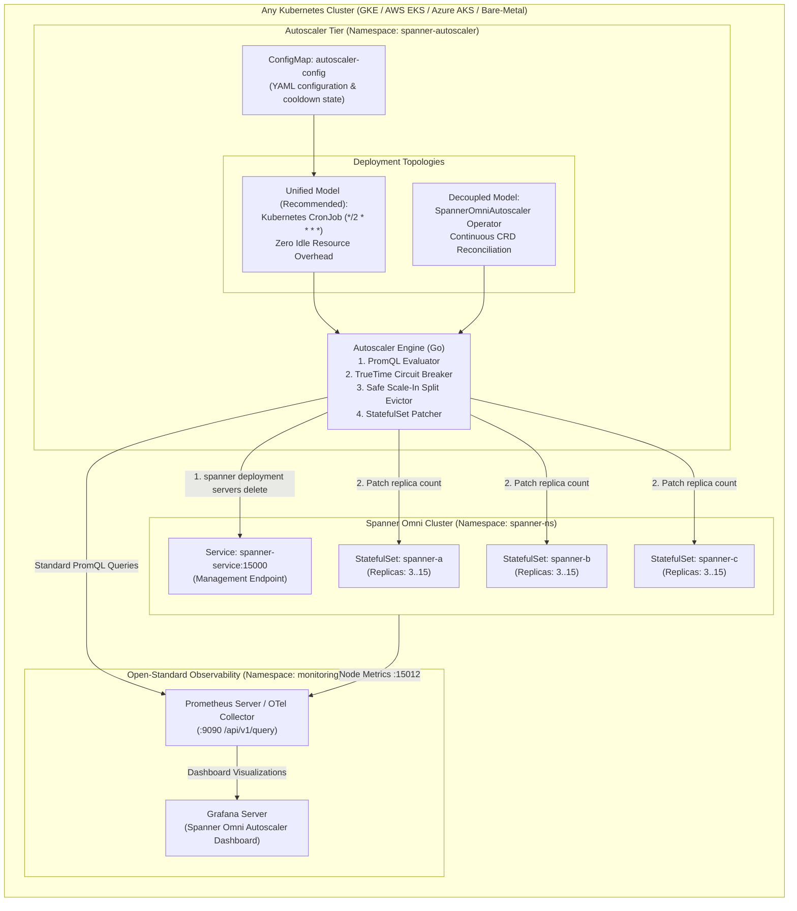
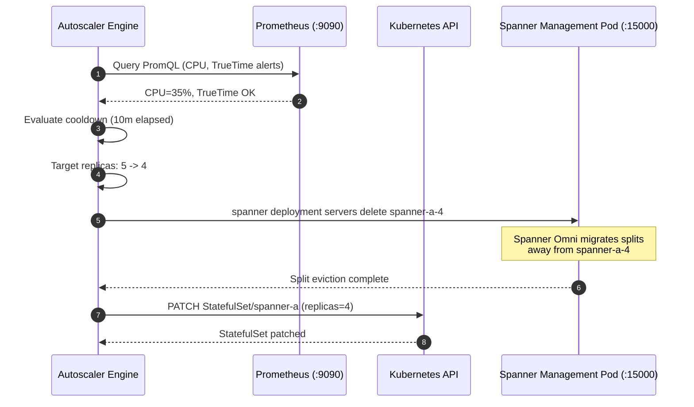

# Google Cloud Spanner Omni Autoscaler Architecture & Engineering Design

*   **Author:** csestu@google.com
*   **Status:** Production Ready / Implemented
*   **Date:** 2026-09-10
*   **Target Engine:** Spanner Omni 2026.r2-beta (Kubernetes StatefulSets)
*   **Target Platforms:** Any Kubernetes Cluster — Google Kubernetes Engine (GKE), Amazon EKS, Azure AKS, and Bare-Metal Kubernetes
*   **Observability Stack:** Open-Standard Prometheus HTTP API & OpenTelemetry (OTel) Collector

--------------------------------------------------------------------------------

## Overview

Enterprise database administrators (DBAs), Site Reliability Engineers (SREs), and Customer Engineers (CEs) running **Google Cloud Spanner Omni** workloads on Kubernetes face unique operational challenges when attempting horizontal compute scaling:

1.  **Stateful Distributed Consensus (Paxos Quorum Protection)**: In Spanner Omni, designated root servers maintain Paxos quorums, split directories, and two-phase commit (2PC). Deleting or scaling down root servers causes immediate cluster partition stalls.
2.  **StatefulSet Reverse-Ordinal Scale-Down vs. Tablet Splits**: Standard Kubernetes StatefulSets terminate pods in strict reverse-ordinal sequence (`pod-N` down to `pod-0`). Terminating a pod before draining its active data splits forces abrupt leader failovers, tablet re-hosting latency, and query errors.
3.  **TrueTime Safety Dependency**: Spanner's serializable isolation and external consistency depend strictly on bounded clock uncertainty. Performing database topology mutations during clock drift or TrueTime outages risks distributed split corruption.
4.  **Multi-Cloud Metric Fragmentation**: Proprietary cloud monitoring APIs (Cloud Monitoring MQL, AWS CloudWatch, Azure Monitor Metrics) require fragmented adapters and vendor lock-in.

**Google Cloud Spanner Omni Autoscaler** is an enterprise-grade, multi-cloud Kubernetes-native autoscaler and observability suite. It provides:
*   **PromQL-Native Poller & Controller**: Zero cloud-provider dependencies; queries standard HTTP Prometheus endpoints (`:9090` / `:15012`).
*   **TrueTime Circuit Breaker**: Immediate freezing of all scaling actions (`BLOCKED_BY_TRUETIME`) upon detection of clock drift or SLA violation.
*   **Safe Scale-In Tablet Eviction**: Automated execution of in-pod `spanner deployment servers delete` before decreasing StatefulSet replica counts.
*   **Dual Deployment Topologies**: Supports both an ultra-lightweight **Unified CronJob Model** (zero idle compute) and a continuous **Decoupled Controller Model**.
*   **Integrated Observability Stack**: Pre-configured Helm and Terraform deployments bundling Prometheus, official Google TrueTime alerts, and Grafana dashboards.

--------------------------------------------------------------------------------

## The Problem

### 1. The Distributed Database Horizontal Scaling Challenge

Unlike stateless web applications that scale seamlessly with standard Kubernetes Horizontal Pod Autoscalers (HPA), Spanner Omni partitions data into dynamic ranges called **splits**. Each server pod in a StatefulSet hosts tens or hundreds of active tablet splits.

When Kubernetes shrinks a StatefulSet from 5 replicas to 3 replicas:
- The Kubernetes API immediately issues a `SIGTERM` to `spanner-a-4` and `spanner-a-3`.
- Any tablet splits actively managed by those pods must suddenly undergo uncoordinated Paxos leader election and emergency state rebuilds.
- Transactions touching those splits encounter transient timeouts or aborted transactions.

### 2. Paxos Quorum & Root Server Fragility

In a 3-zone regional Spanner Omni cluster, the first 3 servers in each zone (indices `0`, `1`, and `2`) are designated as **Root Servers**. They run the Paxos root coordination groups. If an unconstrained autoscaler scales a zone's StatefulSet below 3 replicas:
- The zone loses its Paxos quorum majority.
- The entire regional cluster fails to commit distributed transactions across zones.

### 3. TrueTime Clock Drift in Customer-Managed Infrastructure

Managed Cloud Spanner in Google data centers relies on proprietary atomic clocks and GPS receivers. Spanner Omni, by contrast, operates in customer-managed environments (AWS EKS, Azure AKS, on-prem VMware, bare metal) where NTP or PTP synchronization can drift. Scaling a cluster while clocks drift can cause split-brain or Paxos quorum stalls.

--------------------------------------------------------------------------------

## Goals

*   **G1: Multi-Cloud Universal Compatibility**: Run identically on GKE, AWS EKS, Azure AKS, and Bare-Metal Kubernetes with zero proprietary cloud APIs.
*   **G2: Open-Standard Observability**: Query metrics exclusively via standard PromQL over HTTP (`/api/v1/query`) against Prometheus or OTel collectors.
*   **G3: TrueTime Circuit Breaker Protection**: Freeze scaling operations whenever `TrueTimeUnavailable` or `ClockSlaViolation` alerts trigger.
*   **G4: Root Server Quorum Protection**: Enforce $\text{replicas} \ge \max(\text{minReplicas}, \text{rootServersPerZone})$ to guarantee Paxos quorums are never compromised.
*   **G5: Coordinated Scale-In Split Eviction**: Execute `spanner deployment servers delete` to rebalance data splits prior to StatefulSet shrinkage.
*   **G6: Dual Deployment Topologies**: Provide both the GKE-standard **Unified CronJob Model** and the **Custom Controller Model**.
*   **G7: 1-Click Integrated Monitoring**: Provide self-contained Prometheus and Grafana manifests with official Spanner Omni dashboards and alert rules.

--------------------------------------------------------------------------------

## Non-Goals

*   **NG1: Direct Database Data Path Interception**: The autoscaler does not proxy or inspect SQL queries between clients and Spanner Omni.
*   **NG2: Kubernetes Cluster Autoscaling**: The autoscaler adjusts database StatefulSet replicas; node pool autoscaling is delegated to Karpenter, Cluster Autoscaler, or GKE Autopilot.
*   **NG3: TrueTime NTP Remediation**: The autoscaler halts scaling during clock drift but does not attempt to reconfigure host chrony or NTP daemons.

--------------------------------------------------------------------------------

## Critical User Journeys (CUJs)

### CUJ 1: Automated Scale-Out During Transaction Spike
1. Client applications experience a traffic surge, pushing Spanner Omni CPU utilization past the 65% target threshold.
2. The autoscaler queries Prometheus, verifies that TrueTime is healthy (`true_time_is_available == 1`), and calculates the required replica count using the linear ratio formula.
3. The autoscaler patches the StatefulSet from 3 to 7 replicas.
4. Kubernetes spawns new pods; Spanner Omni automatically registers the new servers and balances tablet splits across the expanded pool.

### CUJ 2: TrueTime Degradation Circuit Breaker
1. An NTP synchronization issue occurs in an availability zone, causing `sla_tester_violation_count > 0`.
2. Even if CPU utilization crosses the scale-out threshold, the autoscaler detects the TrueTime alert.
3. The autoscaler logs `CIRCUIT_BREAKER_TRIGGERED: scaling frozen due to TrueTime SLA violation` and exits without modifying StatefulSet replicas.

### CUJ 3: Safe Coordinated Scale-In
1. Analytical and transactional workload recedes, dropping cluster CPU utilization below 45% for longer than the scale-in cooldown period (default: 10 minutes).
2. The autoscaler identifies candidate pods for removal (highest ordinal index first, e.g. `spanner-a-6`).
3. The engine invokes `spanner deployment servers delete` for server `spanner-a-6`.
4. Spanner Omni migrates data splits away from `spanner-a-6` to remaining servers.
5. Once the split migration completes, the autoscaler decrements the StatefulSet replica count from 7 to 6.

--------------------------------------------------------------------------------

## Technical Architecture

--------------------------------------------------------------------------------

## Subsystem Deep-Dives

### 1. PromQL Metrics Evaluation Engine (`pkg/prometheus`)

The autoscaler evaluates native Spanner Omni indicators exported on port `:15012/metrics`:
*   **CPU Utilization**:
    $$\text{CPU \%} = \frac{\sum \text{spanner\_cpu\_utilization\_by\_priority\_and\_category} \times 100}{\sum \text{spanner\_available\_milligcu}}$$
*   **Storage Utilization**:
    $$\text{Storage \%} = \frac{\sum \text{filesystem\_size\{type="used"\}}}{\sum \text{filesystem\_size\{type="total"\}}} \times 100$$
*   **TrueTime Health**:
    $$\text{TrueTime OK} = (\min(\text{true\_time\_is\_available}) == 1) \land (\max(\text{sla\_tester\_violation\_count}) == 0)$$

### 2. Scaling Calculation Algorithm (`pkg/scaler`)

The target replica count is computed proportionally to target CPU:

$$\text{DesiredReplicas} = \left\lceil \text{CurrentReplicas} \times \frac{\text{CurrentCPU}}{\text{TargetCPU}} \right\rceil$$

Subject to strict safety bounds:
$$\text{TargetReplicas} = \max\left(\max(\text{minReplicas}, \text{rootServersPerZone}), \min(\text{maxReplicas}, \text{DesiredReplicas})\right)$$

### 3. Coordinated Scale-In Protocol (`pkg/spanner`)

--------------------------------------------------------------------------------

## Terraform Infrastructure Specification

The Terraform configuration in `terraform/` deploys the entire autoscaler suite across major cloud providers:

| Platform | Directory | Providers | Description |
| :--- | :--- | :--- | :--- |
| **GKE** | `terraform/examples/gke` | `google`, `helm`, `kubernetes` | Regional GKE cluster deployment with workload identity. |
| **AWS EKS** | `terraform/examples/eks` | `aws`, `helm`, `kubernetes` | AWS EKS deployment with IRSA support. |
| **Azure AKS** | `terraform/examples/aks` | `azurerm`, `helm`, `kubernetes` | Azure AKS deployment with Managed Identity. |

--------------------------------------------------------------------------------

## Automated Test & Quality Guardrails

1.  **Unit Testing Suite**: Tests in `pkg/scaler/`, `pkg/prometheus/`, `pkg/spanner/`, and `pkg/poller/` verify calculation bounds, TrueTime circuit breaking, and scale-in server ordering.
2.  **Lint & Static Analysis**: Enforced via `.github/workflows/ci.yml` running Go tests, `terraform fmt -check`, and `helm lint`.
3.  **Pod Security Standard (Restricted)**: Enforces rootless container execution (UID 65534), read-only root filesystems, dropped capabilities, and non-root security contexts.
