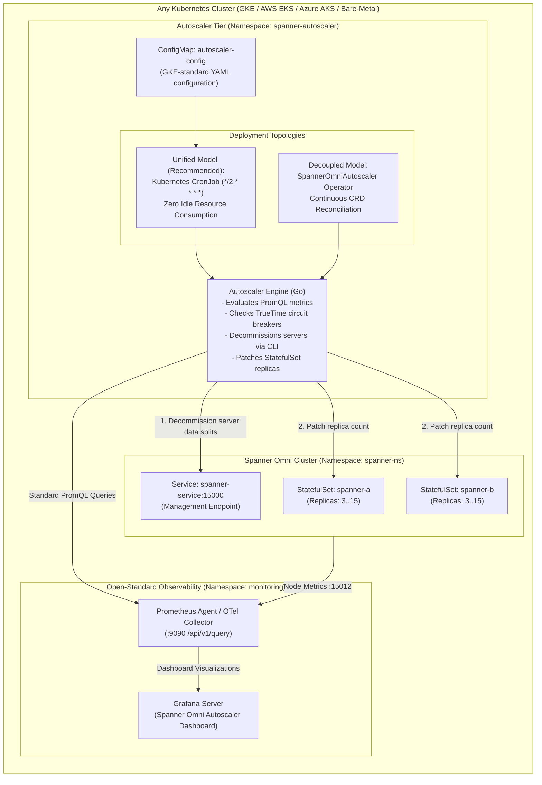

# Google Cloud Spanner Omni Autoscaler Architecture & Engineering Design

*   **Author:** csestu@google.com
*   **Status:** Production Ready / Implemented
*   **Date:** 2026-09-09
*   **Target Engine:** Spanner Omni 2026.r2-beta (Kubernetes StatefulSets)
*   **Target Platforms:** Any Kubernetes Cluster — Google Kubernetes Engine (GKE), Amazon EKS, Azure AKS, and Bare-Metal Kubernetes
*   **Observability Stack:** Open-Standard Prometheus HTTP API & OpenTelemetry (OTel) Collector

--------------------------------------------------------------------------------

## 1. Executive Summary

**Google Cloud Spanner Omni** delivers Google Cloud Spanner's globally consistent, distributed SQL database engine to customer-managed Kubernetes environments, edge locations, and private/multi-cloud data centers.

While cloud-managed Spanner scales compute units via Google Cloud control plane APIs, **Spanner Omni runs as native Kubernetes `StatefulSet` resources**. Horizontal scaling of Spanner Omni introduces critical operational challenges that standard Kubernetes Horizontal Pod Autoscalers (HPA) cannot solve:
1.  **Stateful Database Consensus (Paxos Quorum)**: Root servers coordinate cluster membership, split directories, and two-phase commit (2PC). They must **never** be scaled down horizontally.
2.  **StatefulSet Reverse-Ordinal Scale-Down vs Data Splits**: Kubernetes StatefulSets terminate pods in strict reverse order (`pod-N` to `pod-0`). Deleting a pod before draining its active data splits causes temporary tablet unavailability or failover storms.
3.  **TrueTime Safety Dependency**: Spanner's serializable isolation and external consistency depend strictly on bounded clock uncertainty. Scaling operations during clock SLA violations or TrueTime failure can jeopardize distributed consensus.
4.  **Multi-Cloud Metric Incompatibilities**: Relying on provider-proprietary metric systems (Google Cloud Monitoring, AWS CloudWatch, Azure Monitor) creates fragmentation and lock-in.

This repository codifies the **production reference architecture and engineering implementation** for an enterprise-grade, multi-cloud Kubernetes autoscaler for Spanner Omni, deployable via **Terraform** and **Helm**.

--------------------------------------------------------------------------------

## 2. Engineering Architecture & System Topology

--------------------------------------------------------------------------------

## 3. Core Architectural Pillars

### Pillar 1: Open-Standard Multi-Cloud Observability
- **Standard PromQL Queries**: All metrics are queried over standard HTTP (`/api/v1/query`) against Prometheus or OpenTelemetry Collector. Zero cloud-proprietary APIs (no Cloud Monitoring, CloudWatch, or Azure Monitor).
- **Identical Logic Across Clouds**:
  - **CPU Utilization**:
    $$\text{CPU \%} = \frac{\sum \text{spanner\_cpu\_utilization\_by\_priority\_and\_category} \times 100}{\sum \text{spanner\_available\_milligcu}}$$
  - **Storage Utilization**:
    $$\text{Storage \%} = \frac{\sum \text{filesystem\_size\{type="used"\}}}{\sum \text{filesystem\_size\{type="total"\}}} \times 100$$
  - **Automatic Fallback**: If native Spanner node metrics are temporarily uncollected, the engine seamlessly fails over to cAdvisor `container_cpu_usage_seconds_total` and Kubelet volume stats.

### Pillar 2: TrueTime Health & Circuit Breaker Protection
Spanner Omni exports two critical TrueTime indicators:
- `TrueTimeUnavailable` (`true_time_is_available < 1`)
- `ClockSlaViolation` (`sla_tester_violation_count > 0`)

**Circuit Breaker Logic**: If either alert triggers, the autoscaler halts all scaling actions (`BLOCKED_BY_TRUETIME`), ensuring that distributed split moves and consensus quorums are never disturbed while clocks synchronize.

### Pillar 3: Root Server Protection & Topology Quorum
- Spanner Omni designates root servers (typically 3 per zone) that maintain Raft/Paxos quorums.
- The autoscaler strictly enforces:
  $$\text{TargetReplicas} \ge \max(\text{minReplicas}, \text{rootServersPerZone})$$
- Root servers are cryptographically guarded from horizontal decommissioning.

### Pillar 4: Safe Scale-Down Protocol
Kubernetes StatefulSets remove pods from highest ordinal index down to zero. To prevent data loss or tablet failovers during scale-in:
1. The autoscaler calculates target replica count (e.g. $5 \to 3$).
2. Candidate pods (`spanner-a-4`, `spanner-a-3`) are identified.
3. The engine invokes Spanner Omni management API:
   `spanner deployment servers delete <SERVER_NAME> --zone=<ZONE> --deployment-endpoint=<ENDPOINT>`
4. Spanner Omni migrates data splits away from the candidate server.
5. Only after successful split drain does the autoscaler patch the Kubernetes StatefulSet replica count down.

### Pillar 5: Dual Deployment Topologies
Adapted from [Deploy the Autoscaler tool to GKE](https://cloud.google.com/spanner/docs/set-up-autoscaling-gke):
1. **Unified Model (Recommended)**: Poller and Scaler run inside a single Pod triggered by a Kubernetes **CronJob** (`*/2 * * * *`). Eliminates idle compute/memory overhead.
2. **Decoupled Controller Model**: Runs as a continuous controller watching `SpannerOmniAutoscaler` Custom Resources.

--------------------------------------------------------------------------------

## 4. Security & Compliance Design

1. **Least-Privilege RBAC**:
   - Controller ServiceAccount has permissions scoped strictly to `statefulsets` (patch, get, list), `spanneromniautoscalers` (get, list, watch, update), and read-only `pods`/`pvcs`.
   - Zero cluster-admin escalation privileges.
2. **Pod Security Standards (Restricted Profile)**:
   - Rootless execution (`runAsNonRoot: true`, `runAsUser: 65534`).
   - Read-only root filesystem (`readOnlyRootFilesystem: true`).
   - Privilege escalation blocked (`allowPrivilegeEscalation: false`).
   - Linux capabilities dropped (`capabilities: drop: ["ALL"]`).
   - Default seccomp profile (`seccompProfile: type: RuntimeDefault`).
3. **Zero Secret Exposure**:
   - Relies on in-cluster Kubernetes ServiceAccount token auto-mounting.
   - Internal mTLS/TLS verification supported for Spanner endpoints and Prometheus servers.
